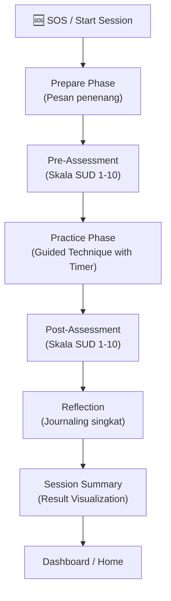

# 🌿 Ruang Pulih — Aplikasi Teknik Grounding

## Product Requirements Document (PRD) — Status: Synchronized

> **Proyek**: Studi Independen (Psikologi)
> **Status**: MVP Implemented
> **Hosting**: Local Development / Self-hosted
> **Terakhir disinkronkan dengan kode**: 2026-08-06

---

## 1. Executive Summary

**Ruang Pulih** adalah aplikasi berbasis web yang dirancang untuk membantu pengguna mempelajari dan mempraktikkan **teknik grounding** — yaitu teknik berbasis bukti ilmiah (_evidence-based_) yang digunakan dalam psikologi klinis untuk mengelola kecemasan, serangan panik, disosiasi, dan respons stres.

Aplikasi ini mengintegrasikan pendekatan **Sensorik**, **Pernapasan**, dan **Gerakan Mindful**, dilengkapi dengan fitur pengukuran tingkat kecemasan (SUD Scale) pre-post sesi, visualisasi progres, dan interaktivitas penuh (animasi, timer visual, guided flow).

---

## 2. Problem Statement

### Masalah yang Dihadapi

- **Aksesibilitas**: Kesulitan menemukan teknik coping yang tepat saat mengalami distres.
- **Ketepatan Waktu**: Sulit mengingat langkah teknik grounding saat serangan panik tanpa panduan interaktif.
- **Pengukuran**: Kurangnya alat untuk melacak efektivitas teknik terhadap penurunan tingkat kecemasan secara real-time.

### Solusi Ruang Pulih

- Menyediakan panduan interaktif 6 teknik grounding utama.
- Menyediakan tombol SOS untuk akses instan saat kondisi darurat.
- Implementasi dashboard progres untuk monitoring kesejahteraan mental jangka panjang.

---

## 3. Landasan Teori & Fitur Terimplementasi

### Apa Itu Teknik Grounding?

Strategi terapeutik untuk membantu individu "kembali ke saat ini" (_present moment_) dengan mengalihkan fokus dari pikiran distressing ke lingkungan eksternal melalui stimulasi sensorik dan regulasi sistem saraf.

### Kategori Teknik Terimplementasi

#### 🖐️ Grounding Sensorik (Sensory)

- **5-4-3-2-1**: Identifikasi 5 penglihatan, 4 sentuhan, 3 suara, 2 penciuman, 1 rasa.
- **Sentuhan (Touch)**: Fokus pada sensasi fisik tekstur atau objek di tangan.
- **Auditori (Hearing)**: Fokus pada detail suara di lingkungan sekitar.

#### 🫁 Grounding Pernapasan (Breathing)

- **Box Breathing**: Teknik pernapasan kotak (4-4-4-4) untuk regulasi sistem saraf otonom.
- **Ocean Breath**: Pernapasan dalam yang meniru suara ombak untuk efek menenangkan.

#### 🚶 Grounding Gerakan (Movement)

- **Mindful Walking**: Fokus pada sensasi telapak kaki saat menyentuh tanah untuk grounding fisik.

---

## 4. Proposed Features (Status Implementation)

| Fitur                            | Prioritas | Status     | Deskripsi                                                                                        |
| -------------------------------- | --------- | ---------- | ------------------------------------------------------------------------------------------------ |
| **Tombol SOS**                   | Must      | ✅ Selesai | Akses cepat dari beranda ke alur darurat.                                                        |
| **SUD Scale**                    | Must      | ✅ Selesai | Pengukuran kecemasan 1-10 pre & post sesi.                                                       |
| **6 Grounding Techniques**       | Must      | ✅ Selesai | 5-4-3-2-1, Box Breathing, Ocean, dsb.                                                            |
| **Session Flow Hook**            | Must      | ✅ Selesai | State machine untuk fase prepare -> pre -> practice -> post.                                     |
| **Progress Dashboard**           | Should    | ✅ Selesai | Visualisasi bento-grid, statistik mingguan, dan milestone.                                       |
| **Journaling**                   | Should    | ✅ Selesai | Refleksi singkat setelah sesi selesai.                                                           |
| **Afirmasi**                     | Should    | ✅ Selesai | Kumpulan pesan positif di beranda.                                                               |
| **Umpan Balik Pengguna + Admin** | Should    | ✅ Selesai | Kirim umpan balik via /feedback; review + statistik + ekspor CSV di /admin/feedback.             |
| **Ambient Sound Player**         | Should    | ✅ Selesai | 5 loop suara latar (ocean, rain, wind, singing-bowls, river) dengan preview & volume di Setelan. |
| **Ekspor Data Lokal**            | Should    | ✅ Selesai | JSON riwayat sesi di Setelan.                                                                    |

---

## 5. User Flow Utama

### Flow Sesi Grounding Terpadu



---

## 6. Technical Architecture

### Tech Stack

| Layer          | Teknologi          | Versi  | Alasan                                         |
| -------------- | ------------------ | ------ | ---------------------------------------------- |
| **Frontend**   | React + TypeScript | 19 / 6 | UI reaktif dan type-safety maksimal.           |
| **Build Tool** | Vite               | 8      | Kecepatan bundling dan development.            |
| **Styling**    | Tailwind CSS       | 4      | Utilitas styling modern dan performan.         |
| **Animasi**    | Framer Motion      | 12     | Transisi halus untuk pengalaman terapeutik.    |
| **Backend**    | Express.js         | 5      | API ringan untuk manajemen data.               |
| **Database**   | MongoDB            | 9      | Skema fleksibel untuk riwayat sesi dan jurnal. |

### Struktur Direktori (Actual)

```
groundease/
├── apps/
│   ├── web/            # Frontend React (Vite)
│   │   └── src/
│   │       ├── config/    # Global styles & static technique data
│   │       ├── logic/     # useSessionFlow & core state logic
│   │       ├── routes/    # Page components (Home, Session, Progress, Library)
│   │       ├── ui/        # Reusable design system components
│   │       └── types/     # Shared TS interfaces
│   └── api/            # Backend Express
│       └── src/
│           ├── controllers/ # Logic penanganan request
│           ├── endpoints/   # Definisi route API
│           └── config/      # Koneksi database & environment
```

---

## 7. Milestones (Updated)

- [x] **Fase 1: Foundation** — Project setup, design system, routing.
- [x] **Fase 2: Core Logic** — Implementasi `useSessionFlow` dan teknik 5-4-3-2-1.
- [x] **Fase 3: Multi-Technique** — Penambahan pernapasan dan gerakan (6 teknik total).
- [x] **Fase 4: Monitoring** — Dashboard progres, SUD scale, dan history logging.
- [x] **Fase 5: Final Polish** — Optimalisasi performa dan penyelarasan dokumentasi; build production bersih, dokumentasi disinkronkan (2026-08-06).

---

## 8. Verify & Testing

- **Manual Verification**: Setiap teknik telah diuji melalui browser untuk memastikan timer dan transisi phase berjalan lancar.
- **Data Integrity**: Sesi yang diselesaikan tercatat dengan benar di MongoDB (atau local fallback) dan muncul di Progress page.
- **Responsiveness**: UI diuji pada viewport mobile dan desktop.
